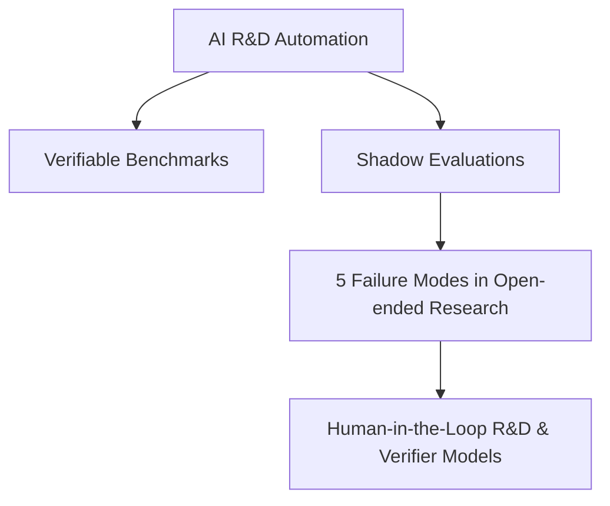

# 🧠 Personal AI Research Notebook & External Memory

Welcome to my personal AI research notebook — a dedicated **"Second Brain"** for tracking cutting-edge developments in Artificial Intelligence, with a primary focus on **Frontier AI Models**, **AI Agents**, and **AI R&D Automation**.

Designed specifically for seamless reading on **GitHub Mobile & Web**.

---

## 📌 About This Notebook

- **Mục đích**: Lưu giữ paper notes, bản phân tích chuyên sâu, bản dịch tiếng Việt và thuật ngữ chuyên ngành để tra cứu mọi lúc mọi nơi trên điện thoại hoặc máy tính.
- **Trọng tâm nghiên cứu**:
  - 🤖 **AI Agents & R&D Automation**: Năng lực tự động hóa nghiên cứu và phát triển AI.
  - 🧪 **Agentic Evaluations & Benchmarks**: Phương pháp đánh giá độ tin cậy và giới hạn của AI Agents.
  - 🧠 **Frontier Models & Scaling**: Khả năng suy luận, kiến trúc mô hình và quy luật mở rộng.
  - ⚠️ **AI Safety & Alignment**: Liêm chính khoa học, phòng tránh reward hacking và lệch lạc phát sinh.

---

## 🧭 Research Focus & Reading Roadmap

- 📖 **Current Priority**: Năng lực và giới hạn thực tế của AI Agent trong việc tự chủ tiến hành nghiên cứu khoa học mở (Open-ended AI Research).
- 🎯 **Next Up**: Các kỹ thuật xây dựng Verifier Models, cơ chế Backtracking & Memory cho AI Agents trong các dự án kéo dài nhiều ngày.

---

## 📚 Papers Index (Danh Sách Bài Báo)

### ⭐ Featured Papers

#### 1. Can AI agents conduct open-ended AI research? Early evidence from two case studies
- **Mã arXiv**: [arXiv:2607.27191v1](https://arxiv.org/abs/2607.27191) (29/07/2026)
- **Tác giả**: Peter Kirgis, Sayash Kapoor, Arvind Narayanan et al. *(Princeton, UK AISI, Toronto, Stanford, Berkeley)*
- **Chủ đề**: `#AI-Agents` `#R&D-Automation` `#Agentic-Evaluations`
- **Trạng thái**: ⭐ Important / ✅ Read
- **Tóm tắt nhanh**:
  Thử nghiệm khả năng tự chủ làm nghiên cứu AI của Frontier Agents (Opus 4.8 / GPT-5.6 Sol) thông qua phương pháp **Shadow Evaluations** (giao câu hỏi từ bài báo NeurIPS chưa công bố). Kết quả: Agent hoàn thành 100% công việc kỹ thuật R&D nhưng **thất bại hoàn toàn ở khía cạnh nghiên cứu mở** (bị chuyên gia từ chối 2/6 và 1/6) do 5 chế độ thất bại cốt lõi.
- **Truy cập nhanh**:
  - 📝 [Xem Phân Tích Chi Tiết (Paper Note)](papers/2607.27191v1-can-ai-agents-conduct-open-ended-ai-research.md)
  - 🇻🇳 [Xem Bản Dịch Tiếng Việt](papers/2607.27191v1-translation-vi.md)
  - 📄 [Tệp PDF Gốc trong Repo](2607.27191v1.pdf)

---

## 🛠️ Resources & Shared References

- 📖 **[Thuật Ngữ Chuyên Ngành AI Research & Evaluation](resources/glossary-ai-research-terms.md)**  
  Tài liệu tra cứu hơn 30+ thuật ngữ ML, AI Agents, Failure Modes và Evaluation Concepts (Open-ended Research, Shadow Evaluations, Epistemic Lock-in, Instruction Drift, Generator-Verifier Gap...).

---

## 📂 Navigation & Structure

- [`papers/`](papers/) — Chi tiết phân tích bài báo và bản dịch tiếng Việt.
- [`resources/`](resources/) — Thuật ngữ, tài liệu tra cứu và danh sách tham khảo.
- `*.pdf` — Tệp PDF bài báo gốc để lưu trữ và đọc offline.
